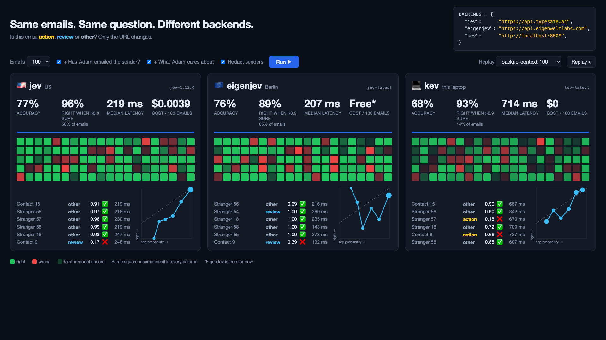

# Test System One models on your own inbox

Sends the same emails and the same question (**action**, **review** or **other**?) to three [System One](https://docs.typesafe.ai) backends, and compares accuracy, speed, cost and calibration:

| Backend | Runs in | What |
|---|---|---|
| `jev` | US | [TypeSafe Jev](https://typesafe.ai), the original |
| `eigenjev` | EU (Berlin) | [Eigenwelt Labs EigenJev](https://platform.eigenweltlabs.com/eigenjev/docs), a hosted clone |
| `kev` | Your laptop | [Kev-4B](https://github.com/jaredpalmer/kev), open weights, runs locally |

All three speak the same API, so the code uses TypeSafe's SDK for every backend and swaps only the base URL (see `backends.py`).



## Results on my inbox

300 emails, labelled by hand. With sender history and my priorities as context:

| | Accuracy | Right when > 0.9 sure | Median time | Cost / 100 emails |
|---|---|---|---|---|
| Jev | 80% | 96% | 230 ms | $0.004 |
| EigenJev | 75% | 91% | 270 ms | $0 (free for now) |
| Kev-4B | 71% | 94% (only 16% of emails) | 730 ms | $0 |

The question's wording and the profile were refined while looking at errors on these same emails, so treat the numbers as optimistic. Small wording changes moved EigenJev's "right when > 0.9 sure" between 83% and 91%; Jev's stayed at 96-97%. Yours will differ: that's the point of running it yourself.

## Try it on your own inbox

You need Python 3.13, [uv](https://docs.astral.sh/uv/), the [`gws` CLI](https://github.com/googleworkspace/cli) logged into your Gmail, and API keys for the hosted backends.

```bash
python3 -m venv .venv && .venv/bin/pip install -r requirements.txt
cp .env.example .env                         # add your TypeSafe and EigenJev keys
cp profile.example.json profile.json         # your name, company and what you care about
.venv/bin/python fetch_emails.py             # ~1000 recent received emails -> data/ (never committed)
.venv/bin/python label.py                    # label 300: a = action, r = review, o = other
```

Start Kev in a second terminal (the first run downloads ~10 GB):

```bash
git clone https://github.com/jaredpalmer/kev.git .cache/kev && cd .cache/kev && uv sync --extra serve
HF_HOME=../huggingface uv run --extra serve python -m kev.serve --run jaredpalmer/kev-4b --port 8009
```

Then run it:

```bash
.venv/bin/python server.py                           # web UI at http://localhost:8080 (press r to run)
.venv/bin/python run.py --history --profile          # or in the terminal, on all labelled emails
.venv/bin/python report.py out/run-*.json --charts   # summary table + calibration charts in out/
```

A backend with no key in `.env`, or that isn't running, is reported and skipped.

## Options

- `--history`: tells the model whether you have ever emailed the sender. Only mail sent *before* that email arrived counts, and out-of-office auto-replies are ignored. This is what stops cold pitches that ask for a reply being marked `action`.
- `--profile`: adds your `profile.json`: what you care about, what you ignore, your colleagues.
- `--replay out/<file>.json`, or `http://localhost:8080/?replay=<name>` in the browser: replays a recorded run at its original pace, with no network. A backup for live demos.
- `--no-redact`: shows real sender names. By default senders are shown as "Colleague 3", "Stranger 12" and so on.
- `--unlabelled`: runs every fetched email; no accuracy, but speed, cost and `report.py --agreement` (how often backends agree).

## What the numbers mean

- **Accuracy**: share of emails where the backend's answer matches your label.
- **Balanced accuracy**: average of per-category accuracy, so a pile of easy `other` emails doesn't flatter anyone.
- **Right when > 0.9 sure**: accuracy on emails where the backend's `confidence` was above 0.9. This is the calibration claim worth testing.
- **Calibration chart**: x = the model's top probability, y = how often it was actually right. A calibrated model sits on the diagonal.
- **Cold → action**: strangers you labelled `other` that the backend marked `action`.

## Privacy

Your emails stay in `data/` and runs in `out/`, both git-ignored, as are `.env` and `profile.json`. Running the hosted backends sends each email's sender, subject and first 600 characters to TypeSafe (US) and Eigenwelt (EU). Kev keeps everything on your machine.

## Licence

MIT
