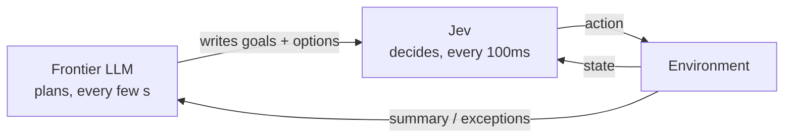

# Jev and System One Models - Talk Research Brief

Sep 23, 2026 · Adam

## Purpose and how to use this brief

Core thesis for the talk: Jev turns judgment into a primitive with the latency and cost of a database query, and the interesting consequences come from where that lets you put intelligence, not from how smart it is.

This brief is the research input for planning a talk to a highly AI-literate audience. They have already seen the viral Jev demos (Doom, the self-driving simulator, email triage), so the talk must go beyond them in three ways:

1. Show unusual uses they probably have not seen.
2. Reason forward about what mass adoption of fast, typed, calibrated decision models changes, including second-order effects.
3. Give an honest, skeptical answer to "is this actually new?", because this audience will ask it.

Evidence conventions used throughout:

- **Vendor claim**: stated by TypeSafe. Not independently verified.
- **Builder claim**: self-reported numbers from community builds (mostly the madewithjev.com gallery). Treat as illustrative, not benchmarked.
- **Analysis**: reasoning in this brief. Labelled as such so the talk can present it as the speaker's view.

The speaker (Adam) is skeptical by temperament and wants claims backed by reasoning. The talk should avoid hype, name the caveats up front, and earn credibility by showing the critique alongside the enthusiasm. Style note: avoid em dashes in any slide or script copy.

## What Jev is

Jev, from TypeSafe AI, is a "System One" model: it takes unstructured state and returns typed decisions with calibrated probabilities, in 70-500ms, and it never writes free text. TypeSafe describes it as "a frontier-intelligence function call: unstructured state in, typed probabilistic decisions out" ([TypeSafe](https://typesafe.ai/blog/introducing-system-one-models-and-jev)).

### The interface

A request has two parts: `state` (any unstructured input, such as a document, game state, DOM or email) and `questions` (typed decision questions with a schema). All questions are answered together in one call. Endpoint: `POST https://api.typesafe.ai/v1/systemone`, model `jev-latest`, with Python and JavaScript SDKs ([DataCamp](https://www.datacamp.com/blog/system-one-models-jev)).

| Primitive | Returns | Typical use |
| --- | --- | --- |
| Choice | One option from a predefined list (max 255), with a probability for each | Routing, intent, next action, classification |
| Score | A number (e.g. 0-100) with confidence | Rubric grading, prioritisation, lead scoring |
| Noul | Probability that a statement is true (0-1) | Yes/no checks, guardrails, verification |

### How it works (as claimed and as reverse-engineered)

TypeSafe claims three innovations: a new architecture built for structured output, parallel sampling that produces all outputs at once rather than token by token, and training called Reinforcement Learning for Calibrated Decisions (RLCD). RLCD rewards honest probability estimates rather than outputs humans prefer.

Archer Hume inferred the likely architecture from 10,000+ API calls ([archerhume.com](https://archerhume.com/posts/jevs-architecture-unmasked/)). His reconstruction:

- A causal transformer, probably a sparse mixture-of-experts. He is least certain about this part.
- The state is encoded once and shared across all questions.
- Each question runs in an isolated branch, so questions cannot see each other's instructions.
- Options within a question are processed together ("listwise"), so they can influence each other.
- Probabilities are read directly from the model rather than generated as text.
- Question branches are batched and scheduled as independent work items.

### Speed, cost and benchmarks (vendor claims)

| Metric | Jev | Frontier LLMs (TypeSafe's comparison) |
| --- | --- | --- |
| Latency | 70-500ms | 3-329s |
| Input price | $0.042 per million tokens | ~48x more (vs GPT-5.6 Terra) |
| Output price | Free | Metered |
| Cost per benchmark case | ~$0.0004 | $0.0304-$0.1761 |
| Accuracy (4-workflow benchmark) | 67.8% | GPT-5.6 Terra 67.9%, Opus 5 73.1%, GPT-5.6 Sol 74.1% |
| Structured output errors | 0% | GPT-5.6 0.58%, Opus 5 5.73% |
| Tool call errors | 0% | GPT-5.6 Sol 17% |

The benchmark covers security incident response, observability, invoice processing and customer service. TypeSafe's own team wrote the workflows, and the reference answers came from OpenAI and Anthropic models. As of September 2026 nobody has reproduced it independently. TypeSafe says its pricing is not subsidised, but long-term sustainability is unproven ([DataCamp](https://www.datacamp.com/blog/system-one-models-jev)).

### Limitations

- It cannot generate text, code or strings. The only outputs are Choice, Score and Noul.
- A Choice question takes at most 255 options, so larger option sets need workarounds (see Design patterns).
- It gives no rationale for its decisions. That is a problem for regulated or audited domains.
- It is about 5-6 points behind the best LLMs on harder tasks in TypeSafe's own benchmark.
- It cannot spend extra compute reasoning at answer time, so it will not match frontier models on deep reasoning ([Sean Goedecke](https://www.seangoedecke.com/jev-means-structured-output-is-interesting-again/)).
- "Never hallucinates" means "never produces output outside the schema". It can still confidently choose the wrong option.

## Out-there uses catalogue

The demos most worth showing this audience have one thing in common: they put judgment somewhere it was never affordable before, such as every keystroke, every page element, every frame or the inside of another model's loop. Unless marked otherwise, all figures are builder claims from the [madewithjev.com](https://madewithjev.com/) gallery, and the "why it's interesting" column is analysis.

### Tier 1: most likely to surprise (recommended for the talk)

| Build | What it does | Builder figures | Why it's interesting |
| --- | --- | --- | --- |
| Keystroke painting | Makes paintings from Jev's pixel probabilities | n/a | Uses the probability distribution itself as the creative medium, not just the top answer. |
| "JevOps" CPU emulation | Experiments using Jev as an instruction decoder / emulator ([The Register](https://www.theregister.com/devops/2026/09/23/shut-up-and-calculate-jevs-new-ai-primitives-for-coders/5298431)) | n/a | A model standing in for part of a computer. A provocative image, though mostly a stunt. |
| jev-compaction plugin | Prunes Claude Code context from 1M to 86K tokens | ~1 second | The fast model manages the slow model's working memory: System 1 as memory manager for System 2. |
| Real-time ad blocker | Classifies every element on a page as ad or not and removes the ads | n/a | Judgment at the level of individual page elements. Unthinkable at LLM prices. |
| Plain-English X filter | Browser extension hides posts matching rules you write in plain language | Real-time | Users run their own ranking rules on their side, on top of the platform's. |
| Voice-controlled browser | Acts on spoken commands before you finish speaking | n/a | Speculative execution of intent. The interface anticipates rather than waits. |
| Keystroke oracle launcher | Re-ranks apps by likely intent on each keystroke | ~100ms | Intent inference at typing speed. |
| Real-time Clippy | Watches product usage and intervenes when it detects the user struggling | n/a | Proactive AI: it watches continuously instead of waiting to be asked. |
| Computer use without screenshots | Local on-device screen segmentation (CoreML) plus Jev decisions | ~90ms per decision | Computer use at human-reflex speed, no vision LLM in the loop. |
| Mobile Jev | Agent driving a real Android phone | 399 actions in ~21 seconds | Roughly 19 actions a second on a real device. |
| Smash Bros vs itself | Controls four characters at once | 22M+ tokens for a couple of cents | Many agents in parallel, each deciding in real time. |
| City traffic control | Jev runs the traffic for an entire simulated city | n/a | Many simultaneous decisions in a system. |
| Predictive spreadsheets | Type a column header and the rows fill themselves | ~100ms | Spreadsheet columns that apply judgment instead of a formula. |
| Chatbot with no LLM | Routes to tools only (web search, Wikipedia, weather, Todoist, Home Assistant) | n/a | Shows how much of a "chatbot" is really routing. |
| Piano improvisation | Jev picks the musical direction, code renders the notes | Real-time | A creative loop where the model steers and ordinary code produces. |

### Tier 2: strong supporting examples

- **Live viral post analyzer**: scores a tweet's potential every 0.5 seconds while you type.
- **AI slop detector**: checks 35 tells of AI-written content in 243ms.
- **SuperX post scoring**: 61 questions per draft in ~1 second for $0.0004.
- **YouTube sponsor skipper**: detects sponsor segments in real time for ~$0.005 per video.
- **Model router**: sends each request to the cheapest model capable of handling it, so Jev becomes the triage layer in front of LLMs.
- **Slack agent**: 2x faster by using Jev for routing and skill selection.
- **DiffJury / PR review**: judges whether pull requests are safe to merge. Another demo reviews every edit an agent makes.
- **jev() for PostgreSQL**: natural-language queries in the database without embeddings.
- **DuckDB extension**: classification inside SQL, ~10 seconds per 1,000 rows.
- **Zillow natural-language search**: classified architecture style and renovation state across thousands of listings in under 20 seconds for $0.18.
- **Website to native app**: converts any URL into an iOS/Android app.
- **Jev trades with a $10,000 bankroll**: autonomous trading decisions. Treat as a stunt.

### Tier 3: already familiar (the audience has likely seen these)

- **Doom**: ~10 decisions a second at ~$7/hour, working from structured game state rather than pixels ([GitHub](https://github.com/tirukovelamanoj/jev-plays-doom)).
- **Self-driving simulator**: built in under an hour with simplified controls, simulation only.
- **Subway Surfers**: superhuman reaction speed for under $0.01.
- **Minecraft**: about 2 minutes of play for ~1 cent (150K tokens), with GPT-6 Astra planning and Jev reacting.
- **Drone obstacle course**: ~15 minutes for ~10 cents.
- **Tetris**: ~0.3 seconds per move, 134 lines in 2 minutes. Also Super Mario Bros, Slay the Spire 2 (0.7s per action), Pokémon Red, chess, and Pong against LLMs.
- **Email triage**: 500 emails for 3.5 cents, 1,500 with 8 workers.
- **Bulk classification**: 1,018 research papers for $0.08 at 256ms median, 700 leads scored in 40 seconds for $0.09, 724 competitor ads analysed in ~40 seconds for $0.09.

One honest data point for the talk: 100,000 posts scored in 20.4 seconds cost $0.67 with Jev versus $0.98 with a traditional LLM approach. For bulk offline work the saving can be modest. Jev's advantage is largest where latency matters.

All the game and driving demos run in simulation, with no real sensors or safety systems. They show rapid prototyping, not production robotics ([MindStudio](https://www.mindstudio.ai/blog/jev-real-time-game-demos)).

## Design patterns that make it work

The skill that matters when building with System One models is designing the option sets and loops around the model, not prompting it. Four patterns recur across builders.

### 1. Tiered goals (from Sean Goedecke's Doom experiment)

Given only raw game inputs as choices, the model held down "shoot" 100% of the time and wandered aimlessly. Adding periodic goal selection produced far more human-like play ([Goedecke](https://www.seangoedecke.com/two-techniques-for-working-with-system-one-models/)). The layered structure he proposes:

| Layer | Cadence | Example decision |
| --- | --- | --- |
| Strategic goal | Every ~10s | Collect armour / kill enemies / find exit |
| Tactical sub-goal | Every ~5s | Clear this room / retreat to corridor |
| Specific target | Every ~1s | Which enemy or item |
| Control loop | Every ~100ms | Move, turn, shoot |

This mirrors decades-old game AI and robotics architecture. Goedecke also suggests defining the goal lists in advance rather than generating them on the fly.

### 2. Tournament sampling

Wikipedia's "baseball" page has over 1,000 links, far above the 255-option limit. Scoring them all separately produced hundreds of equally weighted results. Splitting the links into batches of ~100, picking a winner from each, then choosing again among the winners found the best 3-link path to "sun". The underlying insight: models are better at relative judgments than absolute ratings.

### 3. Planner / reactor (two-speed agents)

A slow LLM plans and writes the options, and Jev acts on them in a tight loop. The Minecraft demo does exactly this: GPT-6 Astra plans, Jev reacts, and the bot fights multiple zombies. The same split appears in jev-browser (the LLM plans, Jev chooses each action).

The slow model manages. The fast model acts. Exceptions and low-confidence moments go back up to the planner.

### 4. Confidence thresholds (analysis)

Calibrated probabilities allow a simple escalation policy:

| Confidence | Action |
| --- | --- |
| Above ~0.97 | Act automatically |
| ~0.80 to 0.97 | Escalate to a frontier LLM (which can also produce a rationale) |
| Below ~0.80 | Route to a human |

The thresholds are illustrative and must be tuned per task by measuring accuracy at each confidence level. This pattern only works if calibration holds, which TypeSafe has not yet shown with published calibration curves (see the novelty section).

## Mass adoption and second-order effects

The step change is not doing classification better. It is putting judgment in places that could not afford a model call before. This whole section is analysis, built on the evidence above. Each effect gives the mechanism, then the consequence.

### 1. Judgment moves inside the loop

**Mechanism:** below about 100ms, a response feels instant to a person. That means judgment can sit inside a keystroke, a UI frame, the inner loop of another program or every branch point in code, not just behind a "submit" button.

**Consequence:** a new category of "smart if-statements". Hand-written rules and heuristics in ordinary code get replaced by model calls. Karpathy is quoted framing this as "latent demand" for "acceptable intelligence" at minimal latency, which may mark a shift away from the race for maximum capability ([The Register](https://www.theregister.com/devops/2026/09/23/shut-up-and-calculate-jevs-new-ai-primitives-for-coders/5298431)).

### 2. The option list becomes the program

**Mechanism:** Jev can only choose from what you give it, so quality depends on the option set and how decisions are layered.

**Consequence:** prompt engineering gives way to what we might call menu engineering. Agents converge on the two-speed shape: the LLM writes the options, the fast model picks from them. This is how game AI and robotics have long been built, and application software will start to look like them.

### 3. Checking everything instead of samples

**Mechanism:** at ~$0.0004 per decision, you can check every transaction, every log line, every claim line or every commit.

**Consequence:** audit, compliance and QA were built on sampling because human judgment was scarce. They can move to checking everything. The bottleneck shifts from "can we check it" to "who handles the flood of flags", and false-positive volume becomes the real design problem, which is where calibration earns its value. The same logic underpins AI verification layers for professional services, such as reviewing tax or accounting work line by line.

### 4. Calibration turns human oversight into a dial

**Mechanism:** if confidence is trustworthy, you can set thresholds for automate / escalate / human review.

**Consequence:** AI stacks become cascades: a cheap triage layer in front, and frontier LLMs only for the hard or uncertain cases. The share of work frontier models see falls sharply, and "human in the loop" becomes a tunable parameter rather than a yes/no design choice. Arguably this matters more than the speed.

### 5. AI that watches instead of waiting to be asked

**Mechanism:** when a judgment costs almost nothing, software can evaluate continuous streams (screen, typing, logs, video) every few hundred milliseconds. Examples are the real-time Clippy and the live viral post analyzer.

**Consequence:** proactive software that notices and intervenes. The new design problems are when to interrupt and how to avoid being creepy. Privacy expectations change because something is always evaluating what you do.

### 6. Anticipatory interfaces

**Mechanism:** intent can be inferred before the input is complete, as in the voice browser that acts mid-sentence or the launcher that re-ranks per keystroke.

**Consequence:** interfaces pre-fetch and pre-execute likely actions. Perceived latency of whole products falls, and the problem becomes undoing a wrong guess gracefully.

### 7. Users get their own algorithms

**Mechanism:** filters can run on the user's side (the X filter, the page-element ad blocker) cheaply enough to evaluate everything on screen.

**Consequence:** power shifts from platform-controlled ranking to user-controlled filtering. That starts an arms race: ads and content get designed to evade classifiers running on users' devices, much as spam evolved against spam filters.

### 8. People write for the judge

**Mechanism:** if most inboxes, applicant tracking systems, support queues and feeds triage with similar models, senders learn what those models reward.

**Consequence:** Goodhart's law at scale. Emails written to score "urgent", CVs written for the scorer, posts tuned to the virality predictor while they are being typed. Text drifts toward whatever the dominant classifiers reward. Few people are talking about this yet.

### 9. The small-classifier industry gets squeezed

**Mechanism:** a zero-shot typed decision from a frontier-grade model is good enough for most classification tasks.

**Consequence:** the old workflow (label a dataset, fine-tune a small model, maintain it) loses its reason to exist for most teams. Labelling vendors and bespoke classifier work shrink. If fast typed decisions become a standard feature of every model API (see the novelty section), this happens faster.

### 10. Code starts branching on probabilities

**Mechanism:** model calls sit at the branch points of code.

**Consequence:** new failure modes. Behaviour shifts when the model version changes, and tests that check "does it pass" become tests that check "does it pass 98% of the time." We will need calibration monitoring, pinned model versions and evaluation suites as standard engineering practice. The tooling for this barely exists.

### 11. Explainability splits from decision-making

**Mechanism:** Jev gives no rationale.

**Consequence:** regulated domains adopt a split pattern. The fast model decides everything, and a slower LLM explains only the decisions that need it (escalations, audit samples, customer disputes). That keeps costs low where explanation is legally required.

## Cost reality check

"Cheap" multiplies fast in continuous loops. The real constraint on AI running everywhere, all the time, is how much state gets re-sent on every call, not intelligence. All maths below is analysis from the published $0.042 per million input tokens and the builders' Doom figures.

### Working back from Doom

- 10 decisions a second is 36,000 decisions an hour.
- $7 an hour ÷ 36,000 = ~$0.00019 per decision.
- $7 an hour at $0.042 per million tokens is ~167M tokens an hour, or ~4,600 input tokens per decision. Almost all of that is the game state being re-sent every call.

### Scaling it up

| Scenario | Decisions per hour | Cost per hour at ~4,600 tokens/decision | Cost per hour at ~500 tokens/decision (state diffs) |
| --- | --- | --- | --- |
| One agent at 1 decision/s | 3,600 | ~$0.70 | ~$0.08 |
| One agent at 10 decisions/s (Doom) | 36,000 | ~$7 | ~$0.76 |
| 1,000 agents at 1 decision/s | 3.6M | ~$700 | ~$76 |
| 10,000 agents at 1 decision/s (city simulation, game NPCs) | 36M | ~$7,000 | ~$760 |

One agent deciding once a second, 24/7, costs roughly $6,000 a year at Doom-sized state. That is cheap for one high-value process, but not free at population scale.

### Implications for the talk

- Sending only what changed, compressing state and caching repeated context become the key engineering levers, much as frame budgets are in game engines.
- Whether TypeSafe caches repeated context or discounts it will significantly affect continuous use cases. It is not documented in the sources reviewed, so it is an open question.
- Builder cost claims don't always add up. The Smash Bros demo claims 22M+ tokens for "a couple of cents", but at list price 22M tokens is ~$0.92. The public launch gave every registered user a $5 credit (about 120M tokens) ([36kr](https://eu.36kr.com/en/p/3992394169613316)), which may explain it. Use builder cost figures cautiously on stage.

## Is Jev novel?

Mostly no: almost every component has existed for years, and the critics who call it productisation plus good marketing are largely right. What is arguably new is the combination at frontier-model quality, plus one substantive but unproven claim about calibration. And the productisation matters more than critics allow.

### Prior art, piece by piece

Prior-art dates and names below come from general knowledge of the ML literature, not from pages opened for this brief. Verify before putting them on slides.

| Jev capability | Prior art | Since | What Jev adds or changes |
| --- | --- | --- | --- |
| One pass, label out, fast | BERT-style classifiers: an encoder plus a classification head | 2018 | No task-specific training needed |
| Arbitrary labels without training | Zero-shot classification via entailment models (e.g. BART-MNLI in Hugging Face); later generalist encoders like GLiNER / GLiClass | ~2019-2023 | Much more intelligent backbone |
| Score options against context | Rerankers (monoBERT, Cohere Rerank) | 2019+ | Generalised into typed questions |
| Frontier-scale model, number out | Reward models: a full LLM with a score attached (InstructGPT era) | 2022 | Exposed as a general API instead of an internal training tool |
| LLM probabilities as classifier output | Force a one-token answer and read the probabilities; G-Eval probability-weighted scoring | 2020-2023 | Packaged, multi-question, calibrated by training |
| Many questions over one context | Prefix / KV caching; shared-prefix batching (Hydragen) | 2023-2024 | Built into the serving architecture |
| Guaranteed valid structured output | Constrained decoding (Outlines, Guidance); OpenAI / Anthropic structured outputs | 2023-2024 | Same guarantee, different mechanism |
| Parallel, non-autoregressive output | Non-autoregressive translation research; diffusion LMs (Inception Mercury, Gemini Diffusion) | 2018 / 2025 | Applied to decisions rather than text |
| Calibration | Guo et al. "On Calibration of Modern Neural Networks" showed overconfidence; GPT-4 report showed RLHF hurts calibration; 2025 research used RL with proper scoring rules to reward calibrated confidence (RLCR) | 2017-2025 | Trained on outcomes and offered as a product guarantee |
| Fast inference | Groq, Cerebras hardware; small distilled models | 2023+ | Latency achieved via architecture, not just hardware |

### The critics' strongest arguments

- **Sean Goedecke**: existing LLMs could reach similar speed by prefilling context and constraining output to a single token, which takes minimal engineering. Competitors can replicate it easily ([Goedecke](https://www.seangoedecke.com/jev-means-structured-output-is-interesting-again/)).
- **Hacker News**: constrained decoding via JSON schemas already exists in the OpenAI and Anthropic APIs. One commenter cites an open-source predecessor (Laya) that had existed for a year. Another claims to have recreated the approach in 2 hours with open-weight models ([HN](https://news.ycombinator.com/item?id=49717558)).
- **Priority dispute**: a developer claims an arXiv paper, model and dataset from March 2025 doing non-autoregressive probability prediction with JSON schema output. Other commenters replied that it was a vertical sales-conversation model built on top of an LLM, not a general zero-shot system ([HN](https://news.ycombinator.com/item?id=49736660)).
- **KDnuggets**: Jev is "an improvement on existing classification techniques, not a revolutionary new AI paradigm". Specialised models beating general ones on narrow tasks is expected ([KDnuggets](https://www.kdnuggets.com/what-everyone-is-getting-wrong-about-typesafe-ais-jev)).
- **Mo Bitar** (quoted by The Register): it is fast and cheap, but benchmarks are limited, so its intelligence is unproven.

### What is arguably new

Archer Hume's summary is the fairest: every component has precedent, but the combination does not. That combination is a broadly capable transformer, the state computed once and shared across questions, a typed output interface, and training that rewards useful uncertainty ([archerhume.com](https://archerhume.com/posts/jevs-architecture-unmasked/)).

The substantive claim is outcome-trained calibration (RLCD). If it holds, confidence thresholds become a reliable engineering tool rather than a hope. But TypeSafe has not published calibration evidence, such as calibration curves or accuracy against the share of cases automated at each threshold. The HN thread called this out directly. Until that exists, the headline advantage is a claim.

### Marketing claims to challenge

| Claim | Reality |
| --- | --- |
| "Never hallucinates" | Never outputs anything outside the schema. It can still confidently choose the wrong option, which is hallucination in practice. |
| "40-200x faster than frontier LLMs" | Measured against LLMs producing full reasoning responses. The fair comparison is an open model with a one-token constrained answer and prefix caching on fast hardware, which is not published. |
| "Similar intelligence to LLMs" | Matches GPT-5.6 Terra but trails the top models by 5-6 points, on a benchmark TypeSafe wrote. |
| "Mathematically impossible to produce type errors" | True, but constrained decoding already offers the same guarantee. |

### Why productisation still matters (analysis)

ChatGPT is the parallel. GPT-3.5 existed and chat interfaces were a known concept, yet the packaging created the category. Jev's equivalent:

- Output tokens are free.
- The API has just three primitives.
- Developers think "call a decision" rather than "craft a prompt, parse the result, handle failures".
- The "System One" framing gives it an identity.

That shift in how developers think is why page-element ad blockers and keystroke-level intent scoring are now being built, even though they were technically possible in 2023.

If the critics are right that it is easy to replicate, the second-order effects arrive faster, not slower. Fast typed decisions become a standard feature of every model API, and TypeSafe's moat is thin. "None of the parts are new" and "this changes how software gets built" can both be true.

## Suggested talk structure, demo and objections

Recommended framing: "None of the parts are new. What's new is where you can now put intelligence, and the one claim worth testing is calibration." Leading with the skeptical view earns trust with this audience, and the rest of the talk then carries more weight. This section is analysis and suggestion for the planning agent to adapt.

### Suggested arc (about 25-30 minutes)

1. **Cold open (2 min):** a surprising Tier 1 demo, such as the page-element ad blocker, the keystroke launcher or context compaction. Deliberately not Doom.
2. **What it is (3 min):** three primitives, typed decisions in, 70-500ms, input-only pricing. One slide on what it cannot do.
3. **The honest bit (4 min):** "Is this new?" Walk through the prior art table and conclude that the combination is new and the calibration claim is unproven.
4. **The reframe (3 min):** judgment becomes as cheap and fast as a database query. The latency threshold of ~100ms for feeling instant.
5. **Weird uses tour (5 min):** four to six Tier 1 examples, grouped by "new places to put intelligence": every page element, every keystroke, inside another model's memory, continuous watching.
6. **Design patterns (4 min):** tiered goals, the planner/reactor split and confidence thresholds. The list of options becomes the program.
7. **Second-order effects (6 min):** pick four or five. Strongest for this crowd: checking everything instead of samples, calibration as a dial, people writing for the judge, users getting their own algorithms, code branching on probabilities.
8. **Cost reality check (2 min):** the 10,000-agent maths. Re-sent state is the constraint.
9. **Close (1 min):** the calibration experiment result, or a provocation about which of today's rule-based systems quietly get replaced.

### Live demo idea: test the calibration claim on stage

A head-to-head that directly answers the novelty question:

1. Take ~200 labelled examples from a realistic task (e.g. support-ticket intent or email triage).
2. Run Jev and an open-weight LLM set up to answer in one token, with prefix caching.
3. Compare accuracy, median and 95th-percentile latency, cost, and calibration (expected calibration error).
4. Show the key chart: accuracy of the cases automated versus the share automated, as the confidence threshold moves. If Jev's curve dominates, calibration is the real contribution. If not, the critics are right.

This is either a strong endorsement or a memorable debunk, and both work on stage. Pre-record a backup run in case of network issues.

Simpler live alternatives: a keystroke-level intent classifier on a text box, or an extension that classifies every element on a live web page and highlights them by category.

### Likely audience objections and answers

| Objection | Suggested answer |
| --- | --- |
| "This is just a BERT classifier / reward model with good marketing." | Mostly agree. The difference is frontier-grade intelligence with zero-shot typed questions and trained calibration. Show the prior art table. |
| "I can do this with logprobs on any LLM." | Yes, and that is Goedecke's point. It means the pattern spreads faster. The open question is whether your logprobs are as well calibrated. Show the demo result. |
| "It can't explain its decisions, so it's useless in regulated work." | Split the two: the fast model decides everything, a slow LLM explains the escalations and audit samples. |
| "The benchmark is vendor-run." | Correct. No independent reproduction as of September 2026. That is why the talk tests it. |
| "'Never hallucinates' is false." | Agree. It means never outside the schema. Wrong-but-confident is still possible. |
| "Games and self-driving demos are toys." | Agree. All simulation, no sensors or safety systems. The point is that the latency is now low enough, not that it is ready for real robots. |
| "Won't OpenAI / Anthropic just ship this?" | Probably. That strengthens the second-order effects and weakens TypeSafe's moat. |

### Open questions for the planning agent

- What is the audience's make-up (builders vs investors vs researchers)? That decides whether to emphasise the design patterns or the effects on markets.
- Is there time and network access for a live demo, or should it be pre-recorded?
- Should the talk connect to the speaker's own work on AI verification layers for tax and accounting (effect 3), or stay general?

## Sources

Pages opened for this brief (September 2026):

- [TypeSafe - Introducing System One Models & Jev](https://typesafe.ai/blog/introducing-system-one-models-and-jev): primary vendor source.
- [madewithjev.com](https://madewithjev.com/): community build gallery, source of most demo figures.
- [Sean Goedecke - Jev means structured output is interesting again](https://www.seangoedecke.com/jev-means-structured-output-is-interesting-again/): critique that it can be replicated.
- [Sean Goedecke - Two techniques for working with System One models](https://www.seangoedecke.com/two-techniques-for-working-with-system-one-models/): tiered goals, tournament sampling.
- [The Register - Shut up and calculate](https://www.theregister.com/devops/2026/09/23/shut-up-and-calculate-jevs-new-ai-primitives-for-coders/5298431): primitives, JevOps, Karpathy and Mo Bitar quotes.
- [DataCamp - Jev explained](https://www.datacamp.com/blog/system-one-models-jev): benchmarks, API, pricing, criticisms.
- [MindStudio - Jev real-time game demos](https://www.mindstudio.ai/blog/jev-real-time-game-demos): Minecraft, Subway Surfers, driving, drone.
- [Archer Hume - Jev's Architecture Unmasked](https://archerhume.com/posts/jevs-architecture-unmasked/): architecture reverse-engineered from API behaviour.
- [KDnuggets - What Everyone Is Getting Wrong About Jev](https://www.kdnuggets.com/what-everyone-is-getting-wrong-about-typesafe-ais-jev): novelty critique.
- [Hacker News - Introducing System One Models and Jev](https://news.ycombinator.com/item?id=49717558): community critique and defence.
- [Hacker News - Open-sourced jev architecture last year](https://news.ycombinator.com/item?id=49736660): priority dispute.
- [36kr - Jev full public launch](https://eu.36kr.com/en/p/3992394169613316): launch date (September 15) and free credit.

Found but not opened (for further reading): [jev-plays-doom on GitHub](https://github.com/tirukovelamanoj/jev-plays-doom), [Anthony Maio - Jev: The Language Model That Won't Talk](https://anthonymaio.substack.com/p/jev-the-language-model-that-wont), [explainx.ai - Jev vs XGBoost/BERT](https://explainx.ai/blog/jev-vs-xgboost-bert-classifiers-2026), [regolo.ai - benchmarks and open-source alternatives](https://regolo.ai/jev-and-system-one-models-benchmarks-open-source-alternatives-and-when-to-use-them/).
